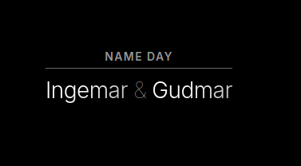

# mirrordash-namnsdag
 
Swedish Namnsdag (Name Day) widget for MirrorDash.

## Features
- Displays daily Swedish name days matching Swedish almanac registries.

## Installation

On the mirror's admin page, open **Modules**: the module is in the list, install it with one click.
Or paste `git+https://github.com/Menturan/mirrordash-namnsdag.git` under **Modules → Install a Module from GitHub**.

Developing it: `uv run pytest` runs its tests, and `uvx mirrordash-sdk validate .` checks it.

## Configuration

This module does not require external API keys. The names come from api.dryg.net (or sholiday.faboul.se when it doesn't answer), once a day. Show or hide the header in the module's settings.

## License
[PolyForm Noncommercial License 1.0.0](LICENSE.md)

## Screenshot

